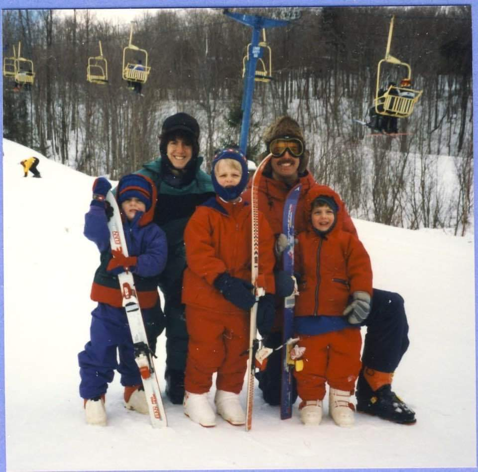
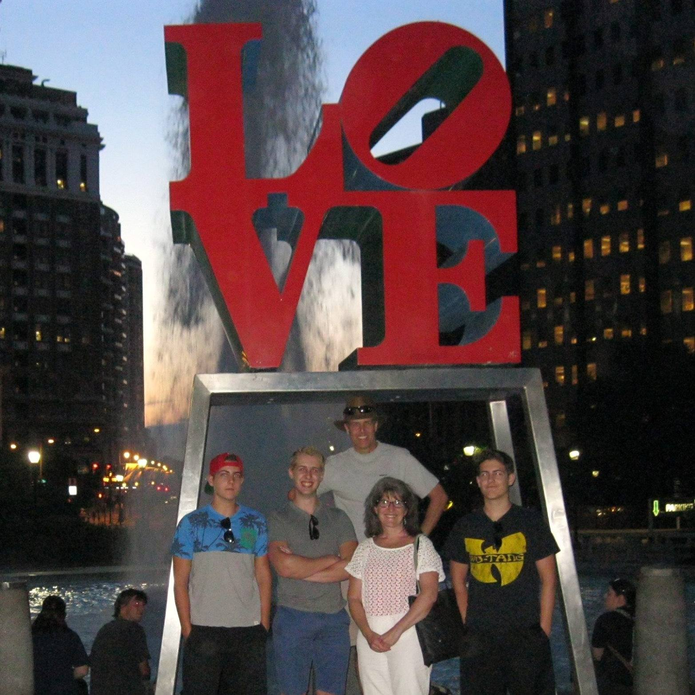
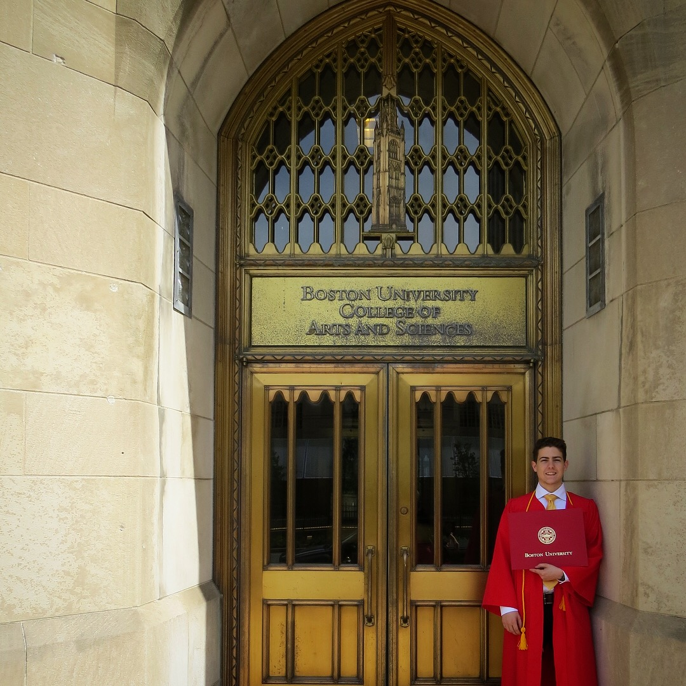

I grew up in Lincoln, RI right outside of Providence and had a pretty picturesque upbringing. With a population of about 20,000 it is a small town full of some great parks and Rhode Island's own Twin River Casino. I often reflect on the amazing memories and lifelong friendships I made during my Rhode Island childhood. Growing up, we spent winters skiing in Vermont and summers at the beach in Narragansett with friends and family. It's a dream of mine to own a large lake house and host all my friends and family. Right now I am absorbing all the knowledge and experience I can from the incredible people I've worked with in order to grow both as a person and a professional. If you can make yourself 1% better every day, over the course of a year that compounds into meaningful improvement.

I am so grateful to family for their support in all my endeavors. It's vital to recognize the importance of your loved ones. I would be nowhere had it not been for my parents, especially when it came to selecting a college — a big decision for an 18-year-old. I have strong opinions about the world in which we live and the systems with which we operate. However, it's those opinions that drive me forward to make changes. I attended [Boston University](https://www.bu.edu/), majored in applied mathematics and computer science, and graduated with cum laude honors. To be honest, college was harder than high school but I'm glad that I went because I met great people and made some lasting memories.

I guess that brings us to the present. These days I live in Boston. I spent much of the COVID-19 pandemic working from home, which was a big change. It was strange at first being isolated but that allowed me to focus on learning. I picked up running when the gyms shut down and completed a couple half marathons since then. I still spend a lot of my free time in the winter skiing with friends and family.
