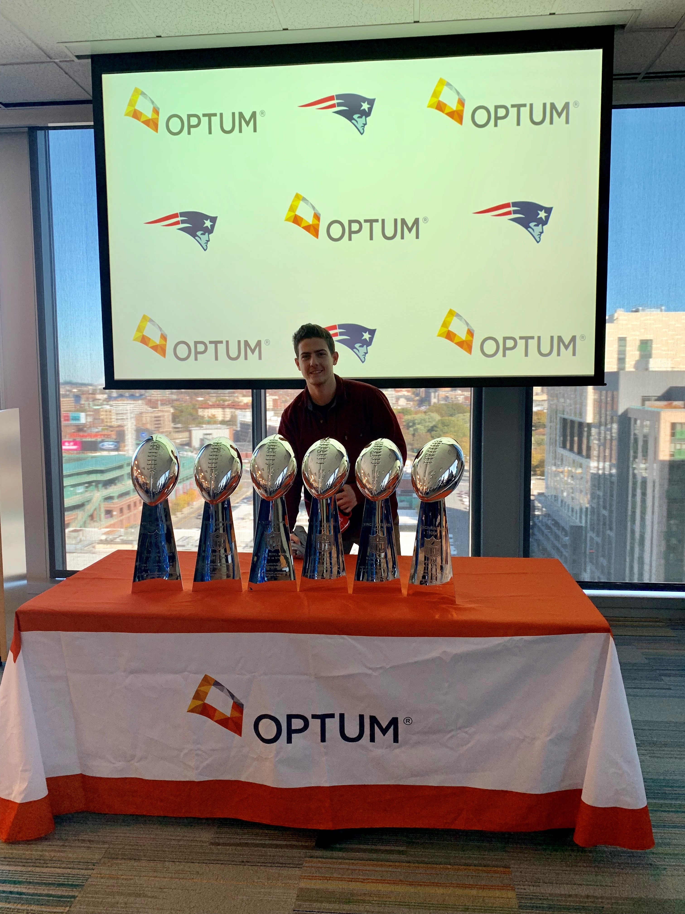

After graduating from Boston University in Spring 2018, I started my career as a Software Engineer at Optum. Optum is the tech subsidiary of UnitedHealth Group, the largest health insurance provider in the country, currently supporting more than 49 million members. Optum provided me a fantastic environment to learn and grow.

I have always had the knack for problem solving and believe that I can apply my skills to industries that are being modernized at a rapid pace. According to Baseline, "Nearly 90% of all data has been created in the last two years." The systems currently supporting some of society's biggest institutions are running on some incredibly antiquated systems that will need to be made more robust and scalable.

Outside of my 9 to 5, I continue to work with new and exciting technologies. I have really enjoyed building out elegant user interfaces while working with serverless and other varied backend systems. The tools available these days are pretty amazing. The speed at which the industry shifts is part of the reason I love it so much. Recently, I worked with some friends to build and automate the deployment of a Discord bot to Amazon Web Services via GitHub Actions. We currently have a mini economy implemented in our chat server that communicates with a database service called FaunaDB. Another project I really enjoyed working on was a consulting contract with the Partnership to Reduce Cancer in Rhode Island ([PRCRI](https://www.prcri.org/annual-cancer-summit)). They are providing a tremendous amount of support to the cancer community in Rhode Island.

After nearly three years of working at Optum, I decided that I wanted to progress my career at a smaller, more dynamic company that would allow me to grow my technical skills faster. I began working at [ZeroNorth](https://www.zeronorth.io/), a Boston based startup, in February 2021 and quickly immersed myself in the world of Cybersecurity. ZeroNorth offered a robust platform for automating and orchestrating security scanning, offering a wide range of tools. Similar to my role at Optum, I worked in a full-stack capacity working with an Angular frontend, Node API, TypeScript libraries and Python security runners. I also directly worked with a wide range of the scanners themselves. I learned a tremendous amount in my time at ZeroNorth and am super grateful for the team we had.

Throughout the first year or two of the COVID-19 pandemic I worked closely with an old friend to launch the digital assets for his local coffee company. Teddy Sullivan's [We Roast Coffee](https://weroast.coffee/) has been a huge hit in our hometown and has developed a big base of locals who sing its praises. Local media outlets have also taken notice:

- [The Valley Breeze](https://www.valleybreeze.com/news/unlock-your-inner-barista-with-we-roast-coffee/article_e204dee8-5897-5521-a8a1-a20767b2a45f.html)
- [tourblackstone.com](https://tourblackstone.com/we-roast-coffee/)

If you're in northern RI, looking for the best cup of coffee around, then pop into his store during business hours at [276 Front Street](https://www.google.com/maps/place/WeRoast+Coffee/@41.9030184,-71.4110711,15z/data=!4m5!3m4!1s0x0:0x33a3e23755923cba!8m2!3d41.9030184!4d-71.4110711). Though word on the street is that they are moving [soon](https://www.valleybreeze.com/news/weroasts-sullivan-to-serve-community-coffee-and-cocktails-at-new-headquarters/article_57d716ac-fe7e-11ee-a708-8f175a596772.html).

We built out an online store with Shopify and hosted it with a nice memorable domain of [weroast.coffee](https://weroast.coffee/).

During initial talks I built out a blog as a proof of concept using a JAMstack (JavaScript, APIs, and Markdown). I implemented the front end using Gatsby which is a JavaScript framework built on top of React. I also used various third-party software and APIs including: [Auth0](https://auth0.com/) for authentication and authorization, [Contentful](https://www.contentful.com/) for content management and [Netlify](https://www.netlify.com/) for automated deployments and cloud hosting. The original blog was since replaced with the Shopify store and front page.

In November of 2021 ZeroNorth was acquired by [Harness](https://harness.io/) which is a leading cloud software development platform that sells a variety of products to enhance the various parts of the software delivery life cycle (SDLC) for hundreds of Fortune 500 companies. ZeroNorth became the first security center Harness product called [Security Testing Orchestration (STO)](https://harness.io/products/security-testing-orchestration/) which we were able to begin selling the Summer of 2022. We were able to create a sellable product within the broader platform in a little more than half a year's work, which I was very proud of.

I have been working for Harness since then doing a wide range of technical work. The results of our hard work were reflected in the overall success of the STO product. I have received various marks of high performance, including multiple Star Performer awards (2022, 2023 and 2024). All of this has helped continue to grow my skills, experience and responsibilities along with the support of my awesome team. I'm now at a point where no problem seems too big because I've seen it all.
